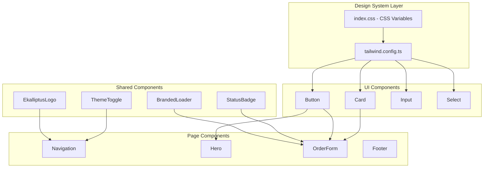

# Design Document: UI Redesign Sync

## Overview

This design document outlines the technical approach for synchronizing the Ekalliptus customer website UI/UX with the admin dashboard design system. The redesign focuses on aligning CSS variables, component styles, and interaction patterns while preserving the customer website's marketing-focused features like the hero section and service showcase.

The synchronization will be achieved through:
1. Updating CSS custom properties to match admin dashboard color tokens
2. Refactoring shared UI components (Button, Card, Badge) to use admin patterns
3. Creating new shared components (EkalliptusLogo, StatusBadge, BrandedLoader)
4. Updating page layouts to match admin's public layout structure

## Architecture



## Components and Interfaces

### 1. CSS Variables (index.css)

The CSS variables will be updated to match the admin dashboard's color system:

```css
:root {
  /* Admin Dashboard Brand Green */
  --background: 0 0% 100%;
  --foreground: 142 71% 15%;
  --primary: 142 71% 45%;
  --primary-foreground: 0 0% 100%;
  --secondary: 142 20% 96%;
  --muted: 142 20% 96%;
  --accent: 142 30% 92%;
  --border: 142 20% 90%;
  --radius: 0.5rem;
}

.dark {
  --background: 142 30% 8%;
  --foreground: 142 20% 95%;
  --primary: 142 71% 55%;
  /* ... matching admin dark mode */
}
```

### 2. EkalliptusLogo Component

```typescript
interface EkalliptusLogoProps {
  className?: string;
  variant?: "full" | "icon";
}
```

SVG-based logo component matching admin dashboard design with:
- Icon variant: 40x40 rounded rectangle with "E" letterform
- Full variant: Icon + "Ekalliptus" text
- Theme-aware colors using CSS classes

### 3. StatusBadge Component

```typescript
type OrderStatus = 'waiting_dp' | 'dp_paid' | 'waiting_onsite_payment' | 'onsite_paid' | 'cancelled';
type PaymentStatus = 'pending' | 'completed' | 'failed' | 'refunded';

interface StatusBadgeProps {
  status: OrderStatus | PaymentStatus;
  variant?: 'default' | 'outline';
  className?: string;
}
```

Color-coded badge component with status-specific styling:
- waiting_dp: yellow-100/yellow-800
- dp_paid: blue-100/blue-800
- onsite_paid: green-100/green-800
- cancelled: red-100/red-800

### 4. BrandedLoader Component

```typescript
interface BrandedLoaderProps {
  message?: string;
  showLogo?: boolean;
  className?: string;
  size?: "sm" | "md" | "lg";
}
```

Loading indicator with:
- Animated EkalliptusLogo (pulse animation)
- Spinning border indicator
- Configurable message text
- Three size variants

### 5. Updated Button Component

The existing Button component will be enhanced with:
- `loading` prop for loading state with Loader2 spinner
- Consistent variant styles matching admin dashboard
- Same hover/disabled state transitions

### 6. Navigation Component Updates

- Replace custom logo with EkalliptusLogo component
- Update glass-panel styling to match admin's backdrop-blur pattern
- Simplify mobile menu to match admin's cleaner design
- Add ThemeToggle component matching admin style

### 7. Order Form Updates

- Restructure using Card-based sections matching admin's PublicOrderForm
- Update form field styling to match admin patterns
- Add StatusBadge for order status display
- Use BrandedLoader for loading states

## Data Models

No database changes required. This is a frontend-only redesign.

### Component Props Types

```typescript
// Shared across components
type ThemeMode = 'light' | 'dark';

// Status types matching database enum
type OrderStatus = 
  | 'waiting_dp' 
  | 'dp_paid' 
  | 'waiting_onsite_payment' 
  | 'onsite_paid' 
  | 'cancelled';

// Logo variants
type LogoVariant = 'full' | 'icon';

// Loader sizes
type LoaderSize = 'sm' | 'md' | 'lg';
```


## Correctness Properties

*A property is a characteristic or behavior that should hold true across all valid executions of a system-essentially, a formal statement about what the system should do. Properties serve as the bridge between human-readable specifications and machine-verifiable correctness guarantees.*

Based on the prework analysis, the following properties can be verified through property-based testing:

### Property 1: CSS Variable Naming Consistency

*For any* CSS custom property defined in the customer website's design system, the variable name SHALL follow the same naming convention (--background, --foreground, --primary, --secondary, --muted, --accent, --destructive, --border, --input, --ring, --radius) as the admin dashboard.

**Validates: Requirements 1.3, 10.1**

### Property 2: Logo Variant Rendering

*For any* valid logo variant ("full" or "icon"), the EkalliptusLogo component SHALL render a distinct SVG output where the "icon" variant produces a smaller element than the "full" variant.

**Validates: Requirements 2.2**

### Property 3: Button Variant Styles

*For any* valid button variant (default, destructive, outline, secondary, ghost, link), the Button component SHALL apply the corresponding CSS classes that match the admin dashboard's buttonVariants definition.

**Validates: Requirements 3.1**

### Property 4: StatusBadge Color Mapping

*For any* valid order status (waiting_dp, dp_paid, waiting_onsite_payment, onsite_paid, cancelled) or payment status (pending, completed, failed, refunded), the StatusBadge component SHALL render with the correct background and text color classes matching the admin dashboard's status configuration.

**Validates: Requirements 5.1, 5.2, 5.3, 5.4, 5.5**

### Property 5: Theme Color Token Consistency

*For any* theme mode (light or dark), the CSS custom properties for primary, background, foreground, and card colors SHALL have HSL values within the green hue range (142 ± 5) matching the admin dashboard's brand color system.

**Validates: Requirements 1.1, 1.3**

## Error Handling

### Component Error Boundaries

1. **Invalid Props**: Components should gracefully handle invalid prop values
   - EkalliptusLogo: Default to "full" variant if invalid variant provided
   - StatusBadge: Display raw status string if status not in config
   - BrandedLoader: Use default message if none provided

2. **Missing CSS Variables**: Fallback values should be defined
   - Use CSS fallback syntax: `hsl(var(--primary, 142 71% 45%))`

3. **Theme Context Errors**: ThemeProvider should handle missing context
   - Default to system preference if context unavailable

### Form Validation Errors

- Display inline error messages with `text-destructive` class
- Use `aria-invalid` and `aria-describedby` for accessibility
- Clear errors on valid input

## Testing Strategy

### Dual Testing Approach

This redesign requires both unit tests and property-based tests:

1. **Unit Tests**: Verify specific component rendering and behavior
2. **Property-Based Tests**: Verify universal properties across all valid inputs

### Property-Based Testing Framework

- **Library**: fast-check (already configured in project)
- **Minimum iterations**: 100 per property test
- **Test file location**: `src/components/__tests__/*.property.test.ts`

### Unit Test Coverage

Unit tests will cover:
- Component rendering with default props
- Component rendering with all prop combinations
- CSS class application verification
- Theme switching behavior
- Loading state transitions

### Property Test Coverage

Property tests will verify:
1. CSS variable naming follows convention (Property 1)
2. Logo variants produce distinct outputs (Property 2)
3. Button variants apply correct classes (Property 3)
4. StatusBadge maps all statuses to colors (Property 4)
5. Theme colors stay within brand hue range (Property 5)

### Test Annotation Format

Each property-based test MUST be tagged with:
```typescript
// **Feature: ui-redesign-sync, Property {number}: {property_text}**
```

### Visual Regression Testing (Manual)

Some requirements cannot be automatically tested:
- Hover state transitions (3.3)
- Spacing patterns (4.3)
- Animation timing (6.2)

These should be verified through manual visual inspection during code review.
